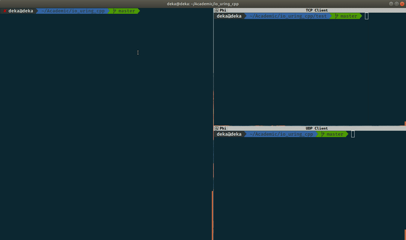

# io_uring_cpp
A CPP wrapper for a asychronous socket server. This code uses Jens Axboe's library "liburing".
Please check this talk at https://www.youtube.com/watch?v=-5T4Cjw46ys

### IO Uring Diagram (image source : https://cor3ntin.github.io/posts/iouring/)

##### Installation procedure for liburing library

    1. Download the latest Release from https://github.com/axboe/liburing/releases
       For example:
       wget https://github.com/axboe/liburing/archive/liburing-0.5.tar.gz
    2. tar -xvzf liburing-0.5.tar.gz
    3. cd liburing-0.5
    4. ./configure [please check the default location of installation using ./configure -h]
    5. make
    6. sudo make install    (or sudo checkinstall, helpfull for removing make install packages)

##### Sample Test

After cloning this repository, please create a dummy file to run the sample test program:
(`dd if=/dev/zero of=1GB.txt count=16 bs=64M`)
(please change the cmake target cpp files for your required test)
    
    1. cmake .
    2. make
    3. ./build/bin/liburing-test 1GB.txt
    
##### Socket Server Test
    1. cmake .
    2. make
    3. ./build/bin/liburing-test  (server is running)
    
    4. g++-10 -std=c++20 udp_client.cpp && ./a.out
    5. g++-10 -std=c++20 tcp_client.cpp && ./a.out

    
#### TODO for socket server features:
    Currently Socket server only supports UDP socket server
    1. Add TCP,SCTP support
    2. Add timer support
    3. Add a task system to parallelize the processing of the client requests.

#### For few Test cases, your linux kernel might need to be updated.
    Follow the steps to update your kernel (replace kernel version with latest once)
    1. sudo apt-get install fakeroot build-essential ncurses-dev xz-utils libssl-dev bc
    2. sudo apt-get install libncurses-dev flex bison libssl-dev wget
    3. wget https://cdn.kernel.org/pub/linux/kernel/v5.x/linux-5.6.2.tar.xz
    4. tar -xvf linux-5.6.2.tar.xz
    5. cd linux-5.6.2
    6. cp /boot/config-$(uname -r) .config
    7. make menuconfig   (same & exit)
    8. make -j 16    (replace with your total logical cores)
    9. sudo make modules_install -j 16
    10. sudo make install -j 16
    11. sudo update-initramfs -c -k 5.6.2
    12. sudo update-grub
    13. sudo reboot
    14. If "invalid signature" error appears in the boot process, then turn off
    secure boot option in the bios. And Restart
    15. Check new kernel with uname -r

Although gcc-10 is not required for this sample file. I am planning to createa a wrapper for Asychronous Socket Server Utilities using lastest C++ version. With gcc-10 we can use C++'s latest threading support as well as many cool features.

If you dont want to use g++-10, you can change the compiler manually in the `CMakeLists.txt` file.

If you want to use gcc-10, then please check:
https://github.com/ddeka0/cppLearn/tree/master/cpp20
